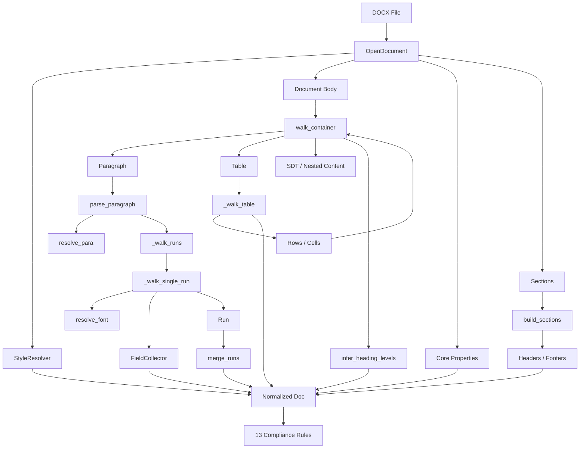
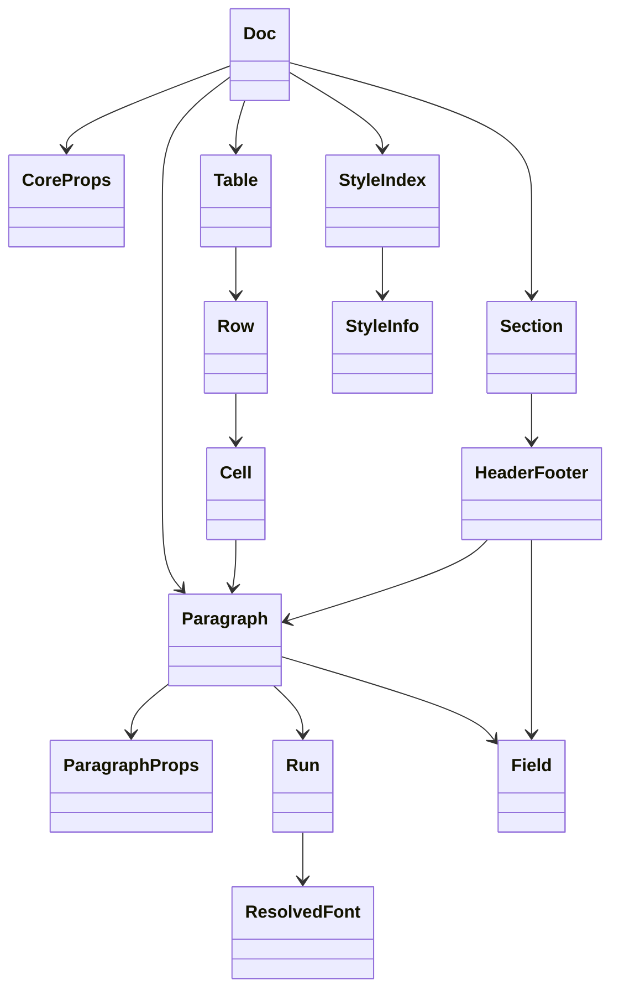
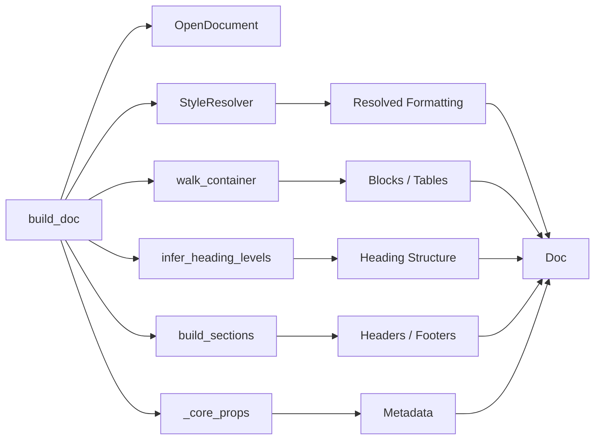
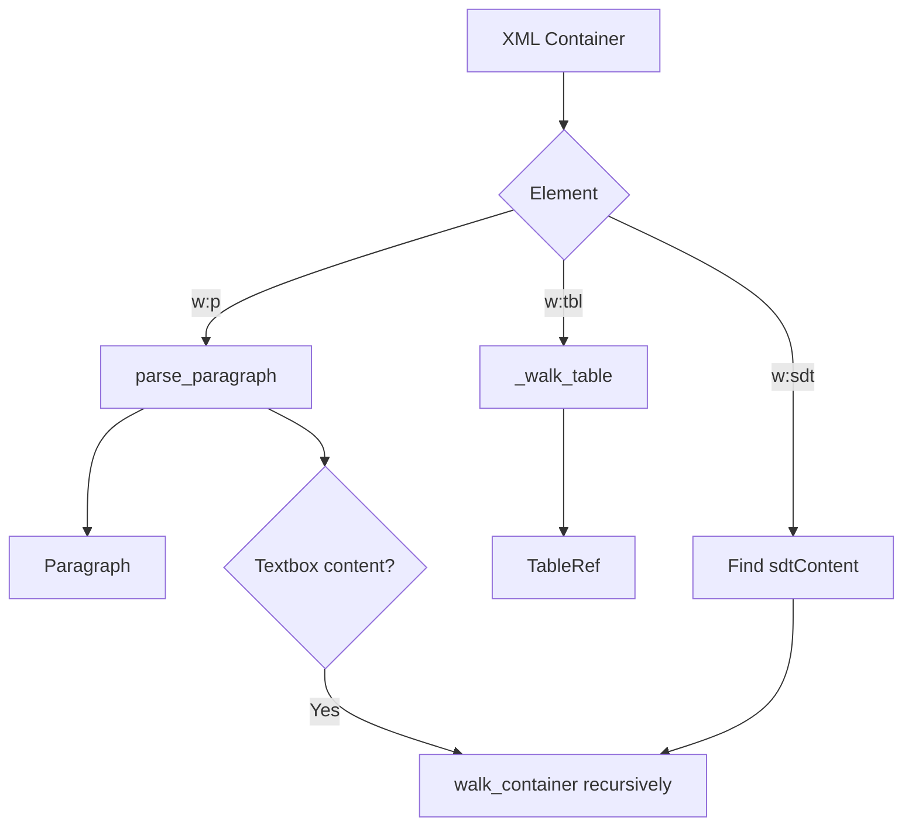
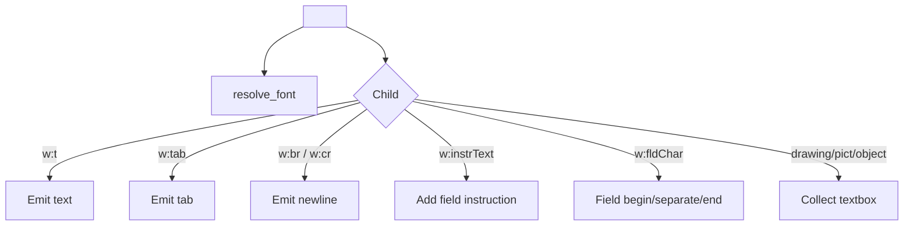
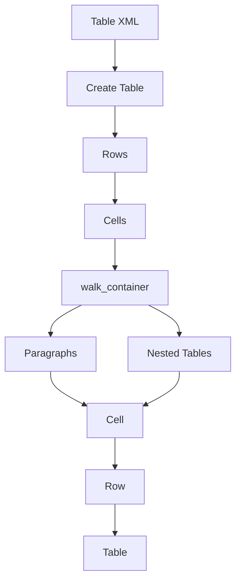
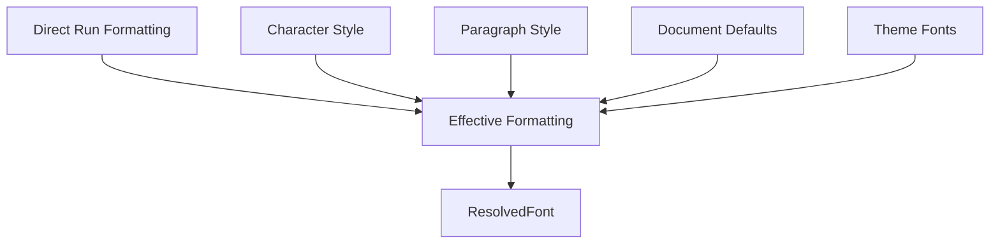
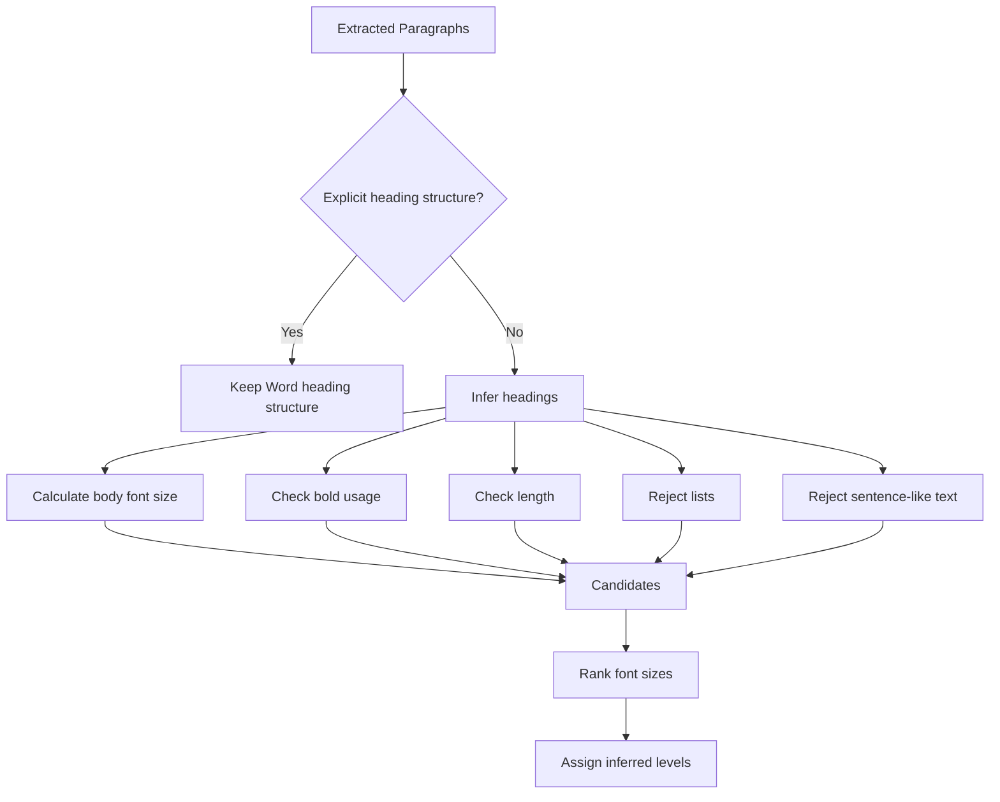
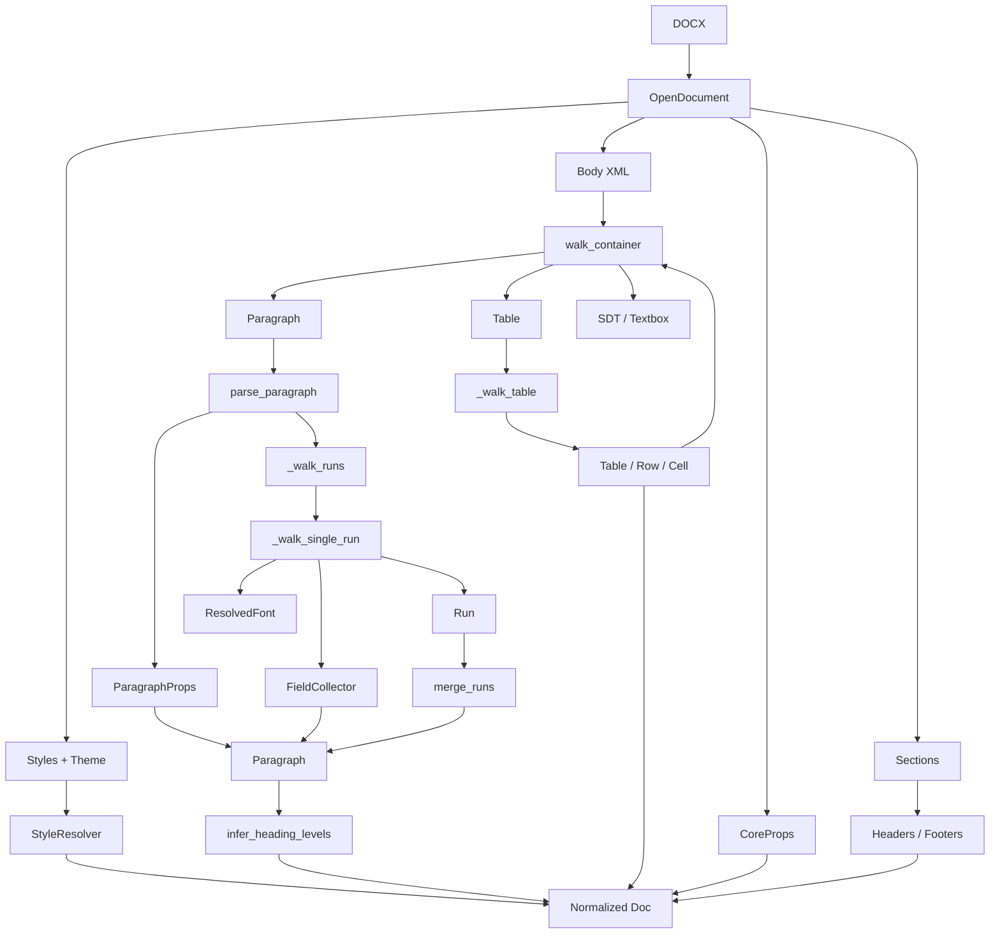
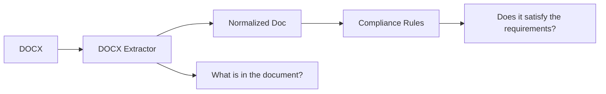

# DOCX Extractor — Architecture & Extraction Flow

## Purpose

`docx_extractor.py` converts a `.docx` document from WordprocessingML/OOXML into a normalized Python `Doc` model.

The extractor is responsible for **what is inside the document**. The compliance layer is responsible for **whether that content satisfies the rules**.

The module produces flow-ordered blocks, resolved fonts, merged runs, field codes, tables, metadata, and section-level headers/footers. The rules consume these dataclasses rather than raw `python-docx` or `lxml` objects.

---

## 1. High-Level Architecture



---

# 2. Three Logical Layers

| Layer | Responsibility | Main components |
|---|---|---|
| **Data Model** | Defines what information is stored | `Doc`, `Paragraph`, `Run`, `Table`, `Section`, etc. |
| **Extraction** | Traverses DOCX XML and collects content | `build_doc`, `walk_container`, `parse_paragraph`, `_walk_runs`, `_walk_table` |
| **Resolution / Processing** | Makes extracted information useful | `StyleResolver`, `FieldCollector`, `merge_runs`, `infer_heading_levels`, `build_sections` |

### Simple mental model

```text
Dataclasses
    ↓
WHAT do we store?

Extraction functions
    ↓
HOW do we get it?

Resolution / processing
    ↓
HOW do we make it meaningful?

Normalized Doc
    ↓
What the compliance rules consume
```

---

# 3. Why a Normalized Model?

A DOCX is not a flat text file.

```text
Document
│
├── Paragraph
│   ├── Run
│   ├── Run
│   └── Field
│
├── Table
│   ├── Row
│   │   └── Cell
│   │       ├── Paragraph
│   │       └── Nested Table
│
├── Section
│   ├── Header
│   └── Footer
│
├── Textbox
├── SDT
├── Styles / Theme
└── Metadata
```

Plain-text extraction would lose information needed by formatting and structural compliance rules.

The extractor therefore preserves **content + formatting + structure + provenance**.

---

# 4. Dataclass Architecture



## Dataclass Reference

| Dataclass | Responsibility |
|---|---|
| `Doc` | Root normalized document |
| `CoreProps` | Title, author, dates and other document metadata |
| `Paragraph` | Extracted paragraph content, formatting, fields and location |
| `ParagraphProps` | Paragraph style, heading, spacing, alignment, indentation and list state |
| `Run` | Continuous text with one effective formatting context |
| `ResolvedFont` | Effective font name, size, bold, italic, underline and color |
| `Field` | Word field instruction/result such as `PAGE` or `NUMPAGES` |
| `TableRef` | Table's position in top-level document flow |
| `Table` | Complete table |
| `Row` | Table row |
| `Cell` | Table-cell blocks |
| `Section` | Section-level header/footer structure |
| `HeaderFooter` | Header/footer paragraphs and fields |
| `HeadingEntry` | Normalized heading information |
| `StyleInfo` | Individual Word style |
| `StyleIndex` | Summary of styles, theme fonts and defaults |

---

# 5. `Doc` — Root Model

```python
@dataclass
class Doc:
    filename: str
    core: CoreProps
    blocks: list[Block]
    tables: list[Table]
    sections: list[Section]
    styles: StyleIndex
```

Think of `Doc` as the **single contract between the extractor and compliance engine**.

```text
Doc
│
├── filename
├── core
├── blocks
├── tables
├── sections
└── styles
```

---

# 6. Paragraph → Run → Font

A paragraph can contain multiple runs.

Example:

```text
This is important text.
```

may be:

```text
Run 1: "This is "     → normal
Run 2: "important"    → bold
Run 3: " text."       → normal
```

Therefore:

```text
Paragraph
   │
   ├── Run
   ├── Run
   └── Run
```

`Run` stores:

```python
Run(
    text="important",
    font=ResolvedFont(...)
)
```

This preserves formatting that would disappear in plain text extraction.

---

# 7. Tables

The table hierarchy is:

```text
Table
  │
  ├── Row
  │    ├── Cell
  │    │    ├── Paragraph
  │    │    └── ...
  │    └── Cell
  │
  └── Row
```

`Cell.blocks` can contain paragraphs and nested tables.

The extractor also records table provenance:

```text
Table 1, row 2, cell 3
```

This allows rules to distinguish body content from information stored in tables.

---

# 8. Sections / Headers / Footers

```text
Section
│
├── headers
│   ├── default
│   ├── first
│   └── even
│
└── footers
    ├── default
    ├── first
    └── even
```

The extractor also handles **linked-to-previous** headers and footers.

This is important for rules checking:

- page numbers
- footer IDs
- confidentiality text
- header content

---

# 9. Actual Extraction Procedure

The main entry point is:

```python
build_doc(file, filename)
```

The procedure is:

```text
1. Open DOCX
2. Initialize StyleResolver
3. Create traversal context
4. Walk document body
5. Extract paragraphs / tables / nested content
6. Resolve runs and fields
7. Merge equivalent runs
8. Infer headings when required
9. Extract sections, headers and footers
10. Extract core metadata
11. Assemble final Doc
```

---

# 10. `build_doc()` — Orchestrator

The actual control flow is:



`build_doc()` is primarily an **orchestrator**. Specialized functions perform the actual extraction.

---

# 11. `Ctx` — Traversal State

`Ctx` maintains state shared during recursive traversal.

```text
Ctx
│
├── resolver
├── tables
└── _counter
```

`next_index()` creates stable block indexes:

```text
Paragraph → block 0
Paragraph → block 1
Table     → block 2
Paragraph → block 3
```

This allows the extractor to preserve document flow.

---

# 12. `walk_container()` — Main XML Walker

`walk_container()` is the central recursive traversal function.



It can therefore be reused for:

- document body
- table cells
- SDT content
- textbox content

This is why recursion is important: Word documents are hierarchical.

---

# 13. Paragraph Extraction

When a `<w:p>` is found:

```text
<w:p>
  │
  ├── paragraph properties
  │       ↓
  │   resolve_para()
  │
  └── runs
          ↓
      _walk_runs()
          ↓
      _RunSink
          ↓
      merge_runs()
          ↓
      Paragraph
```

`parse_paragraph()` creates the final `Paragraph` object.

It stores:

- complete text
- merged runs
- paragraph properties
- fields
- table/textbox provenance
- location

---

# 14. `_RunSink`

`_RunSink` is a temporary accumulator for one paragraph.

```text
_RunSink
│
├── resolver
├── style_id
├── fields
├── runs
├── text
└── textboxes
```

When text is emitted, it is added to:

```text
paragraph text
      +
Run(text, font)
      +
field result tracking
```

This keeps the recursive run-processing functions simple.

---

# 15. `_walk_runs()`

The run walker handles different Word XML structures:

```text
<w:r>              → _walk_single_run()
<w:fldSimple>      → simple field
<w:sdt>            → recurse into sdtContent
<w:hyperlink>      → recurse
<w:ins>            → recurse
<w:smartTag>       → recurse
<w:customXml>      → recurse
<w:del>            → ignore tracked deletion
```

This is more complete than simply using `paragraph.text`.

---

# 16. `_walk_single_run()`

A single `<w:r>` can contain:

```text
<w:t>               normal text
<w:tab>             tab
<w:br> / <w:cr>    line break
<w:noBreakHyphen>   hyphen
<w:instrText>       field instruction
<w:fldChar>         field boundaries
<w:drawing>         possible textbox
<w:pict>            possible textbox
<w:object>          possible textbox
```

The process is:



---

# 17. Field Extraction

Word fields can be represented as complex fields or simple fields.

Examples:

```text
PAGE
NUMPAGES
DATE
REF
```

The `FieldCollector` reconstructs them.


The resulting object contains:

```text
kind
instruction
result
simple
```

This lets compliance rules detect dynamic fields instead of relying only on visible text.

---

# 18. Run Merging

Word may split identical formatting into multiple runs.

Example:

```text
Before:
Run("Doc")
Run("ument")
Run(" title")

After:
Run("Document title")
```

`merge_runs()` merges adjacent runs when their formatting keys match.

The formatting comparison includes:

```text
font name
font size
bold
italic
underline
color
```

This creates a cleaner representation for the rules.

---

# 19. Table Extraction

When a table is encountered:

```text
<w:tbl>
    ↓
_walk_table()
```

The procedure is:



The table is registered before recursively processing its cells, allowing nested content to be represented safely.

---

# 20. Style Resolution

Formatting in Word can come from multiple sources.



`StyleResolver` loads:

- document defaults
- paragraph styles
- character styles
- `basedOn` relationships
- theme fonts

Then it resolves the effective properties.

---

# 21. Style Inheritance

Styles can inherit from other styles.

Example:

```text
Heading 2
    ↓ basedOn
Heading 1
    ↓ basedOn
Normal
    ↓
Document Defaults
```

The resolver:

1. Builds the `basedOn` chain.
2. Merges properties from root to leaf.
3. Gives the leaf style precedence.
4. Caches merged results.

```text
Raw styles
    ↓
basedOn chain
    ↓
Merged style
    ↓
Cache
    ↓
Effective formatting
```

---

# 22. Paragraph Style Resolution

For paragraph properties, the resolver combines:

```text
Direct paragraph properties
        ↓
Merged paragraph style
        ↓
Document defaults
```

It resolves:

- style ID/name
- outline level
- heading level
- spacing
- line spacing
- alignment
- indentation
- list state

The result becomes `ParagraphProps`.

---

# 23. Heading Inference

The extractor first respects explicit Word heading information.

If no heading/outline structure exists, it can infer headings from visual formatting.



The current implementation uses:

| Signal | Purpose |
|---|---|
| Minimum 4 body paragraphs | Avoid inference on very small documents |
| Maximum 12 words | Headings are usually short |
| No sentence-ending punctuation | Helps distinguish headings from prose |
| Not a list | Avoid false heading detection |
| Larger than body text | Strong heading signal |
| Bold when bold is uncommon | Secondary signal |

If Word already provides heading/outline structure, inference stops and does not replace it.

---

# 24. Sections, Headers and Footers

`build_sections()` processes every document section.

```text
Document
│
├── Section 1
│   ├── Header
│   └── Footer
│
├── Section 2
│   ├── Header
│   └── Footer
│
└── ...
```

It checks default, first-page and even-page variants.

For linked headers/footers, the extractor inherits content from the previous section.

---

# 25. Core Metadata

`_core_props()` reads:

```text
document.core_properties
```

and produces:

```text
CoreProps
│
├── title
├── author
├── subject
├── keywords
├── created
├── modified
└── last_modified_by
```

This keeps document metadata separate from visible body content.

---

# 26. Flow Order and Provenance

The extractor maintains a stable `block_index`.

Example:

```text
Block 0 → Paragraph
Block 1 → Paragraph
Block 2 → TableRef
Block 3 → Paragraph
Block 4 → TableRef
```

For paragraphs inside tables, the extractor also records:

```text
table index
row
column
```

Locations can therefore look like:

```text
Paragraph 5
Table 1, row 2, cell 3
Text box (block 12)
```

This provenance is useful when a rule needs to know **where** information was found.

---

# 27. `Doc.iter_paragraphs()`

The `Doc` model provides helpers for accessing paragraphs in flow order.

It walks:

```text
top-level blocks
    ↓
TableRef
    ↓
Table
    ↓
Rows
    ↓
Cells
    ↓
Nested blocks
```

Headers and footers are deliberately not included in the normal body paragraph iterator.

This gives the compliance layer a clean concept of **body flow**.

---

# 28. Complete Extraction Pipeline



---

# 29. Extraction vs Compliance



### Extractor

Answers:

- What paragraphs exist?
- What text exists?
- What formatting applies?
- What tables exist?
- Where is content located?
- What headings exist?
- What fields exist?
- What headers/footers exist?
- What metadata exists?

### Compliance engine

Answers:

- Is the title valid?
- Is the author present?
- Are revision dates valid?
- Is the version consistent?
- Are required sections present?
- Are page numbers present?
- Is formatting consistent?
- Is readability acceptable?

---

# 30. Why This Separation Matters

Without normalization:

```text
Rule 1 ──→ DOCX/XML
Rule 2 ──→ DOCX/XML
Rule 3 ──→ DOCX/XML
...
Rule 13 ─→ DOCX/XML
```

Every rule would need to understand Word internals.

With normalization:

```text
                    ┌── Rule 1
                    ├── Rule 2
DOCX → Extractor → Doc → Rule 3
                    ├── ...
                    └── Rule 13
```

The DOCX complexity is handled once.

The rules operate on a stable Python domain model.

---

# 31. Function Responsibility Table

| Function / Class | Responsibility |
|---|---|
| `build_doc()` | Orchestrates complete extraction |
| `Ctx` | Maintains traversal state |
| `walk_container()` | Recursively walks XML containers |
| `_walk_table()` | Extracts table/row/cell hierarchy |
| `parse_paragraph()` | Builds `Paragraph` |
| `_RunSink` | Accumulates paragraph extraction state |
| `_walk_runs()` | Traverses run-level XML |
| `_walk_single_run()` | Interprets individual runs |
| `FieldCollector` | Reconstructs Word fields |
| `merge_runs()` | Combines adjacent equivalent runs |
| `StyleResolver` | Resolves effective formatting |
| `build_sections()` | Builds section/header/footer model |
| `_capture()` | Captures one header/footer |
| `infer_heading_levels()` | Recovers visual headings |
| `_core_props()` | Extracts core document metadata |

---

# 32. Function → Input → Output

| Function | Input | Output |
|---|---|---|
| `build_doc()` | DOCX file | `Doc` |
| `walk_container()` | XML container | blocks |
| `parse_paragraph()` | `<w:p>` | `Paragraph` |
| `_walk_runs()` | paragraph XML | runs/text/fields |
| `_walk_single_run()` | `<w:r>` | run text/fields |
| `_walk_table()` | `<w:tbl>` | `TableRef` + `Table` |
| `resolve_font()` | run properties + style | `ResolvedFont` |
| `resolve_para()` | paragraph properties | `ParagraphProps` |
| `build_sections()` | document sections | `Section[]` |
| `_core_props()` | core properties | `CoreProps` |
| `merge_runs()` | `Run[]` | merged `Run[]` |
| `infer_heading_levels()` | blocks + tables | inferred headings |

---

# 33. Example: One Paragraph Through the Extractor

Suppose the document contains:

```text
Revision History
```

formatted as bold 14pt Heading 1.

The Word structure is conceptually:

```text
<w:p>
│
├── <w:pPr>
│      └── Heading 1
│
└── <w:r>
       ├── <w:rPr>
       │     ├── bold
       │     └── size
       │
       └── <w:t>
             └── Revision History
```

The extractor produces:

```text
Paragraph
│
├── text = "Revision History"
│
├── props
│   ├── style = Heading 1
│   └── heading_level = 1
│
└── runs
    └── Run
        ├── text = "Revision History"
        └── font
            ├── size = 14
            └── bold = True
```

The rule now works with `Paragraph`, not XML.

---

# 34. What the Extractor Preserves

| Category | Extracted information |
|---|---|
| **Content** | Paragraphs, runs, tables, textboxes, headers, footers |
| **Formatting** | Font, size, bold, italic, underline, color |
| **Paragraph structure** | Styles, headings, spacing, alignment, indentation, lists |
| **Tables** | Tables, rows, cells, nested content |
| **Fields** | PAGE, NUMPAGES, DATE, REF and field instructions |
| **Sections** | Headers, footers, variants, linkage |
| **Metadata** | Title, author, subject, keywords, created/modified |
| **Provenance** | Block index, table position, textbox location |

---

# 35. Complexity

For `E` relevant XML elements, the main traversal is approximately:

```text
Time:  O(E)
Space: O(E)
```

The extractor retains the normalized representation, so memory usage grows with document structure and extracted content.

Additional work is performed for:

- style resolution
- style caching
- heading inference
- run merging
- section/header/footer extraction

---

# 36. Senior Developer Explanation

### Problem

> "A DOCX is a hierarchical WordprocessingML document, not a flat text file. Our rules need both content and formatting information."

### Solution

> "This module acts as a normalization layer. It traverses the document structure and converts it into a domain-specific `Doc` model."

### Dataclasses

> "The dataclasses define the target representation. `Doc` is the root, with paragraphs, tables, sections, metadata and styles. Paragraphs contain runs and fields, tables contain rows and cells, and sections contain headers and footers."

### Traversal

> "`walk_container()` is the recursive XML walker. It handles paragraphs, tables and nested structures. `parse_paragraph()` handles paragraph extraction, while `_walk_runs()` and `_walk_single_run()` handle inline content."

### Formatting

> "`StyleResolver` resolves effective formatting because Word formatting can come from direct properties, character styles, paragraph styles, document defaults and theme fonts."

### Fields

> "`FieldCollector` reconstructs Word fields such as PAGE and NUMPAGES, which allows the compliance layer to inspect dynamic document elements."

### Final boundary

> "The final `Doc` is the contract between extraction and compliance. The extractor answers 'what is in the document?', while the compliance layer answers 'does it satisfy the requirements?'"

---

# 37. One-Slide Summary

```text
                       DOCX
                         │
                         ▼
                 WordprocessingML
                         │
                         ▼
                Recursive XML Walker
                         │
          ┌──────────────┼──────────────┐
          ▼              ▼              ▼
      Paragraphs       Tables        Sections
          │              │              │
        Runs          Rows/Cells    Headers/Footers
          │
        Fields
          │
          ▼
     Style Resolver
          │
          ▼
    Heading Inference
          │
          ▼
    ┌───────────────┐
    │  Normalized   │
    │      Doc      │
    └───────┬───────┘
            │
            ▼
      Compliance Rules
            │
            ▼
       PASS / FAIL / N/A
```

## Core takeaway

> **The dataclasses define the document model. The recursive extractor populates that model. The resolver makes formatting effective. The compliance rules consume the resulting `Doc` without needing to understand DOCX XML.**

## Architectural principle

> **Parse once → Normalize once → Reuse everywhere**
